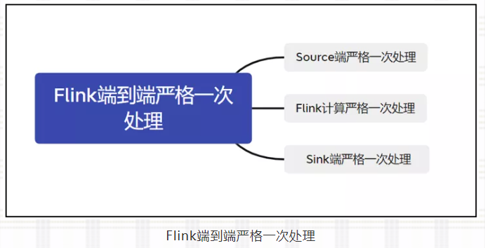

# 一、什么是Exactly Once?

## 概述

流系统要实现 Exactly-Once，需要保证上游 Source 层、中间计算层和下游 Sink 层三部分同时满足端到端严格一次处理，如下图：



**Source端:** 数据从上游进入Flink，必须保证消息严格一次消费。同时Source 端必须满足可重放（replay）。否则 Flink 计算层收到消息后未计算，却发生 failure 而重启，消息就会丢失。

```java
@SpringBootApplication
public class LoggerApplication {
    public static void main(String[] args) {
        SpringApplication.run(LoggerApplication.class);
    }
}
```
